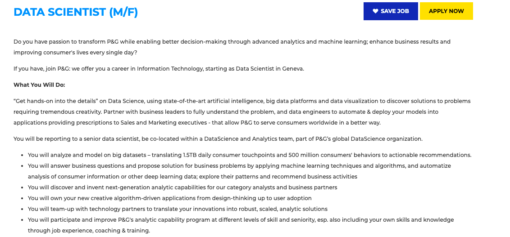

# Task 1: Data Science Careers

These three postings are not very alike, but each offers something that interests me. The first is the biggest company, and in this case, it looks like that means a diverse set of tasks and problems to be solved - I wouldn't get bored! And the best part is that the job is in Switzerland. The second job is the most realistic; it's an internship in Montreal that includes a specific list of tasks such as "Write effective, scalable code", and "Assess and prioritize feature requests" and others, all of which I think I could do. The third is not actually a job (I hope thats ok!), but a program at UBC that connects data science and social good. Their past projects have included assessing green infrastructure and creating user-friendly access to property-based info in the province. This one is probably the most interesting and appealing to me, because if I were to go into data science out in the real world I would want work on projects I care about - rather than doing something I enjoy (the work itself) but without any outcome I actually care about (I wouldn't find increasing a big business' revenue very enticing, for example).

Insert the job descriptions here (links, info, etc) and the images.

# Task 2: Highs and Lows

Highlights: 

- I liked the set-up of a weekly small project. They were the appropriate size for the given time frame and kept me on schedule, which I find more difficult with online classes.
- I found the small section about modularity very helpful. It's a term that is thrown around in a lot of classes, but actually taking the time to go over it and explain how you modularize your code (as the expert you are) was great. I think every project I did thereafter was done better and more clearly - so maybe you should even cover this earlier on!

Could be done better:
- Synchronicity. Asynchronous courses are difficult for a lot of students, in terms of staying engaged and on track. Obviously best case would be in person, but even just doing live lectures can make a big difference for giving students an opportunity to ask questions as you go. 
- Timing. This is somewhat related, but posting all the lectures for a week at once and sometimes earlier or later than the given week makes it more difficult to stay on track and know where I'm supposed to have watched up until.
- Not having your camera on in office hours. I know that a lot of students also don't put theirs on, but at least for me, actually seeing a face makes a big difference when I'm trying to ask questions and get help.

Future: This class has made me question the path I was on beforehand. I'm still interested in my major (which is not comp) but now I wonder if there is a way of integrating data science and programming into that, because I enjoy it so much. I kind of feel like it's not possible because I don't know how to program ML, but maybe there's a way!